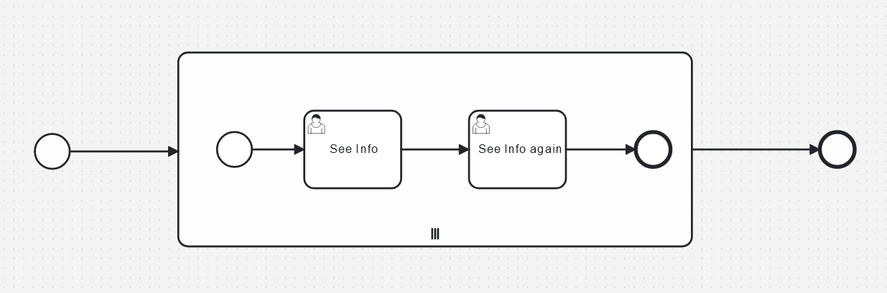

# Multi-Instance User Assignment Camunda8
This is an example using BPMN and Camunda 8 to show how a multi-instance subprocess can be used to assignee a dynamic list of users to a task

In this example you have a form where you can add as many usernames as you like, then for each entry in that list the subprocess will be activated. The user tasks when then be assigned the user in question. 

